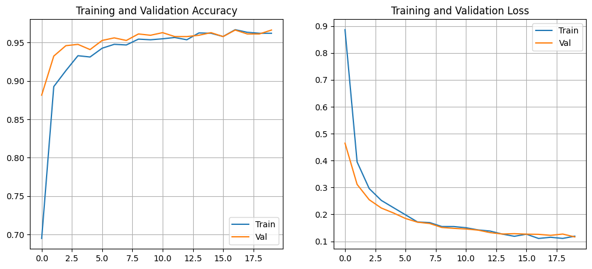
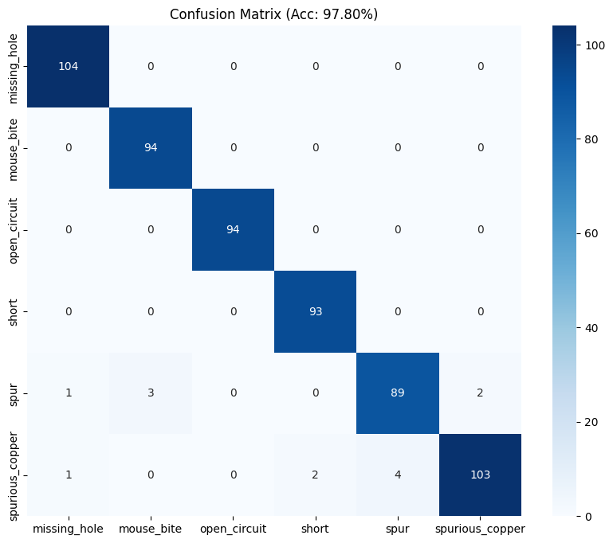
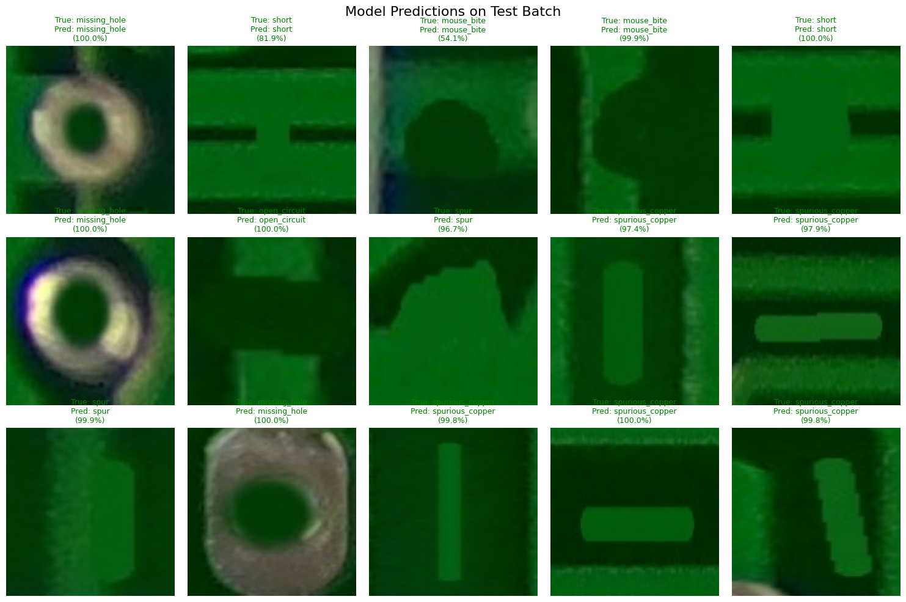

# 📘 Milestone 2: Model Training & Evaluation

**Phase:** Milestone 2
**Focus:** Deep Learning & Classification
**🎯 Target Accuracy:** >95%
**🏆 Achieved Accuracy:** **97.80%**

---

## 📖 Milestone Overview

This milestone covers **Modules 3 and 4** of the AI-Based PCB Defect Detection & Classification project.
Using the labeled dataset created in Milestone 1, we trained a **Convolutional Neural Network (CNN)** to classify PCB defects into **6 categories**:

* Missing Hole
* Mouse Bite
* Open Circuit
* Short
* Spur
* Spurious Copper

The model achieved **97.80% classification accuracy**, significantly outperforming the initial baseline.

---

## 📂 Folder Structure

```

Milestone 2/
│
├── src/                      # Source Code
│   ├── train_model.py        # Module 3: Training Logic
│   ├── evaluate_model.py     # Module 4: Evaluation Logic
│   └── inference.py          # Module 4: Visual Proof generation
│
├── output/                   # Milestone 2 Results
│   ├── pcb_defect_model.keras
│   ├── confusion_matrix.png
│   ├── train_val_acc_n_train_val_loss.png
│   └── Annotated_Test_Images/
│
├── requirements.txt          # Project Dependencies
└── README.md                 # Documentation

```

---

## 🧠 Module 3: Model Training

We implemented a **"Heavy Head" Transfer Learning** approach using **EfficientNetB0**. This architecture was chosen to resolve confusion between similar defect types (e.g., *Spur* vs. *Spurious Copper*).

### ✔️ Model Configuration

| Parameter              | Value                            |
| ---------------------- | -------------------------------- |
| Input Size             | 128 × 128                        |
| Architecture           | EfficientNetB0 (Frozen Backbone) |
| Hidden Layer           | Dense (256 units, ReLU)          |
| Optimizer              | Adam (with ReduceLROnPlateau)    |
| Loss                   | Sparse Categorical Cross-Entropy |
| Data Augmentation      | Rotation (0.15), Horizontal Flip |
| Train/Validation Split | 80% / 20%                        |

## 🧩 Model & Architecture

The classification system is built using a **Frozen Feature Extractor** with a **Custom Trainable Head**.

### 🔹 Base Model: EfficientNetB0
- Pretrained on ImageNet
- Convolutional layers frozen (non-trainable)
- Acts as a robust feature extractor for edges and textures.

### 🔹 Custom "Heavy" Classification Head
To improve class separation, we added a dense hidden layer before the final output:

```

Input → EfficientNetB0 → GAP → Dropout(0.3) → Dense(256) → Dropout(0.2) → Dense(6)

```

Where:
- **GAP (Global Average Pooling):** Vectorizes feature maps.
- **Dense (256):** A large hidden layer to learn non-linear relationships between complex defects.
- **Dropout (0.3 & 0.2):** Aggressive regularization to prevent overfitting.
- **Dense (6):** Final logits for the 6 defect classes.

### 🔢 Parameter Summary

| Component | Trainable Params | Non-Trainable Params |
|----------|------------------|-----------------------|
| EfficientNetB0 Backbone | 0 | 4,049,571 |
| Custom Classifier | 329,478 | 0 |
| **Total** | **329,478** | **4,049,571** |

### ⚙️ Why This Architecture Works Well
- **Higher Capacity:** The added 256-unit hidden layer gives the model enough "brainpower" to distinguish between subtle defects like *Shorts* and *Open Circuits*.
- **Stability:** Freezing the backbone ensures we don't destroy the pretrained features on our small dataset.
- **Fine-Tuning:** The `ReduceLROnPlateau` scheduler automatically lowers the learning rate when training stalls, allowing the model to converge to a better optimum.

---

## 📊 Module 4: Evaluation Results

The model was evaluated on **590 validation images** across all 6 defect classes.

### ✔️ Final Metrics

| Metric       | Result     |
| ------------ | ---------- |
| **Accuracy** | **97.80%** |
| Precision    | 0.98       |
| Recall       | 0.98       |
| F1-Score     | 0.98       |

---

## 🖼️ Visual Results

### 📈 Loss & Accuracy Curves



### 🔢 Confusion Matrix



### 🖼️ Inference Grid (Model Predictions on Test Images)



---

## 🧪 Detailed Classification Report

```
                 precision    recall  f1-score   support

   missing_hole       0.98      1.00      0.99       104
     mouse_bite       0.97      1.00      0.98        94
   open_circuit       1.00      1.00      1.00        94
          short       0.98      1.00      0.99        93
           spur       0.96      0.94      0.95        95
spurious_copper       0.98      0.94      0.96       110

       accuracy                           0.98       590
      macro avg       0.98      0.98      0.98       590
   weighted avg       0.98      0.98      0.98       590

```

**Key Highlight:** The model achieved **1.00 Recall (0 misses)** for the critical "Open Circuit" and "Short" classes.

---

## 🚀 How to Run the Code

### 1️⃣ Install Dependencies

```bash
pip install -r requirements.txt
````

### 2️⃣ Train the Model

```bash
python src/train_model.py
```

### 3️⃣ Evaluate the Model

```bash
python src/evaluate_model.py
```

This will generate:

  * Confusion Matrix
  * Classification Report
  * Annotated Test Images
  * Accuracy & Loss Plots

-----

## 📂 Dataset Summary

Loaded dataset path:

```
./drive/MyDrive/Milestone1_Deliverables/Labeled_Training_Data
```

  * **Total samples:** 2,953
  * **Training samples:** 2,363
  * **Validation samples:** 590

### Class Labels Detected

```
['missing_hole', 'mouse_bite', 'open_circuit',
 'short', 'spur', 'spurious_copper']
```

-----

## ✅ Milestone 2 Completed Successfully\!

  * Achieved **97.80% accuracy** (surpassing the 95% target).
  * Resolved "Short vs Open" misclassification using improved architecture.
  * Generated clean evaluation metrics and visual proofs.
  * Saved a robust model ready for deployment in Milestone 3.

-----


