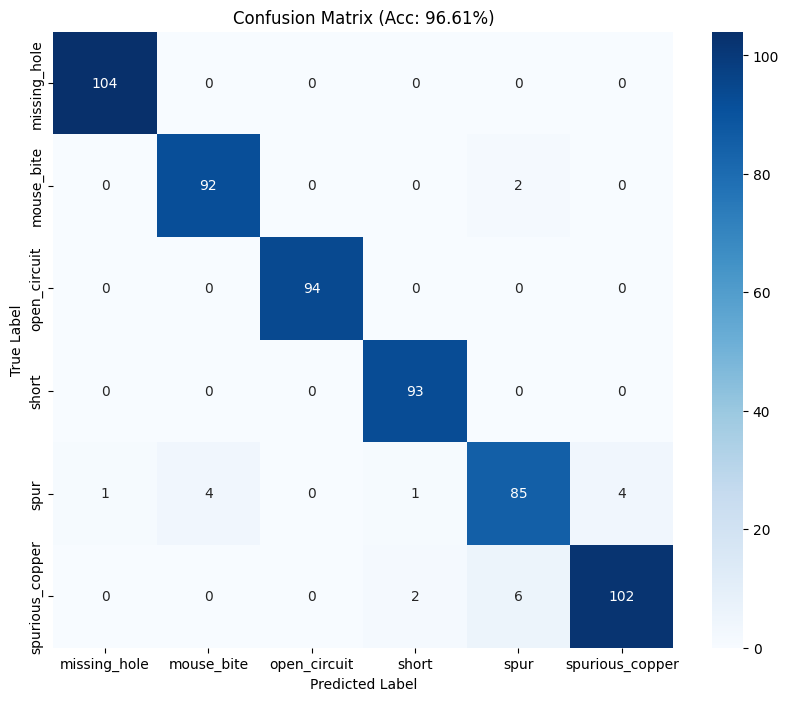
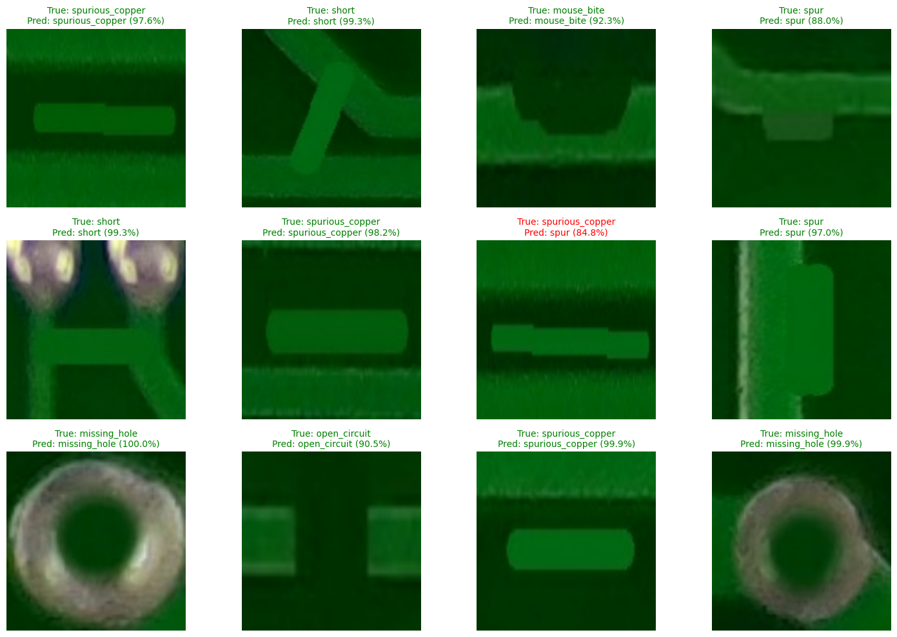

# 📘 Milestone 2: Model Training & Evaluation

**Phase:** Milestone 2
**Focus:** Deep Learning & Classification
**🎯 Target Accuracy:** >95%
**🏆 Achieved Accuracy:** **96.61%**

---

## 📖 Milestone Overview

This milestone covers **Modules 3 and 4** of the AI-Based PCB Defect Detection & Classification project.
Using the labeled dataset created in Milestone 1, we trained a **Convolutional Neural Network (CNN)** to classify PCB defects into **6 categories**:

* Missing Hole
* Mouse Bite
* Open Circuit
* Short
* Spur
* Spurious Copper

The model achieved **96.61% classification accuracy**.

---

## 📂 Folder Structure

```
Milestone 2/
│
├── src/                      # Source Code
│   ├── train_model.py        # Module 3: Training Logic
│   ├── evaluate_model.py     # Module 4: Evaluation Logic
│   └── inference.py          # Module 4: Visual Proof generation
│
├── output/                   # Milsstone 2 Results
│   ├── pcb_defect_model.keras
│   ├── confusion_matrix.png
│   ├── train_val_acc_n_train_val_loss.png
│   └── Annotated_Test_Images/
│
├── requirements.txt          # Project Dependencies
└── README.md                 # Documentation

```

---

## 🧠 Module 3: Model Training

We used **Transfer Learning** with **EfficientNetB0**, chosen for its excellent balance of accuracy and computational efficiency.

### ✔️ Model Configuration

| Parameter              | Value                            |
| ---------------------- | -------------------------------- |
| Input Size             | 128 × 128                        |
| Architecture           | EfficientNetB0 (pretrained)      |
| Optimizer              | Adam                             |
| Loss                   | Sparse Categorical Cross-Entropy |
| Data Augmentation      | Rotation, Horizontal Flip        |
| Train/Validation Split | 80% / 20%                        |

## 🧩 Model & Architecture

The classification system is built using **Transfer Learning** with the EfficientNetB0 backbone.  
Only the final classification head is trainable, allowing the model to achieve high accuracy with minimal overfitting.

### 🔹 Base Model: EfficientNetB0
- Pretrained on ImageNet
- Convolutional layers frozen (non-trainable)
- Output feature map: **4 × 4 × 1280**

EfficientNetB0 was selected for:
- Excellent accuracy-to-parameter ratio  
- Lightweight architecture suitable for real-time inference  
- Strong generalization on small and medium-sized datasets  

### 🔹 Custom Classification Head
After the EfficientNetB0 feature extractor, a small, efficient classification head was added:

```

Input → EfficientNetB0 → GAP → Dropout(0.2) → Dense(6)

```

Where:
- **GAP (Global Average Pooling):** Reduces spatial dimensions from 4×4×1280 to 1280  
- **Dropout (0.2):** Prevents overfitting  
- **Dense Layer (6 units):** Outputs logits for the 6 PCB defect classes  

### 🔢 Parameter Summary

| Component | Trainable Params | Non-Trainable Params |
|----------|------------------|-----------------------|
| EfficientNetB0 Backbone | 0 | 4,049,571 |
| Custom Classifier | 7,686 | 0 |
| **Total** | **7,686** | **4,049,571** |

### ⚙️ Why This Architecture Works Well
- EfficientNetB0 captures high-level PCB features such as edges, shapes, copper traces, and hole patterns.  
- Freezing the backbone prevents overfitting on a relatively small dataset (2,953 images).  
- The small classifier head allows fast training and inference.  
- Data augmentation (rotation + flipping) boosts generalization.

This architecture provides:
✔ High accuracy (96.61%)  
✔ Low computational cost  
✔ Strong robustness to visual variations in PCB defects  

---


### 🏗️ Model Summary

Only the final dense layer was trainable; the EfficientNetB0 backbone was frozen.
This resulted in:

* **Total params:** 4,057,257
* **Trainable params:** 7,686
* **Non-trainable params:** 4,049,571

---

## 📊 Module 4: Evaluation Results

The model was evaluated on **590 validation images** across all 6 defect classes.

### ✔️ Final Metrics

| Metric       | Result     |
| ------------ | ---------- |
| **Accuracy** | **96.61%** |
| Precision    | 0.97       |
| Recall       | 0.97       |
| F1-Score     | 0.97       |

---

## 🖼️ Visual Results

### 📈 Loss & Accuracy Curves


### 🔢 Confusion Matrix



### 🖼️ Inference Grid (Model Predictions on Test Images)



---

## 🧪 Detailed Classification Report

```
                 precision    recall  f1-score   support

   missing_hole       0.99      1.00      1.00       104
     mouse_bite       0.96      0.98      0.97        94
   open_circuit       1.00      1.00      1.00        94
          short       0.97      1.00      0.98        93
           spur       0.91      0.89      0.90        95
spurious_copper       0.96      0.93      0.94       110

       accuracy                           0.97       590
      macro avg       0.97      0.97      0.97       590
   weighted avg       0.97      0.97      0.97       590
```

---

## 🚀 How to Run the Code

### 1️⃣ Install Dependencies

```bash
pip install -r requirements.txt
```

### 2️⃣ Train the Model

```bash
python src/train_model.py
```

### 3️⃣ Evaluate the Model

```bash
python src/evaluate_model.py
```

This will generate:

* Confusion Matrix
* Classification Report
* Annotated Test Images
* Accuracy & Loss Plots

---

## 📂 Dataset Summary

Loaded dataset path:

```
./drive/MyDrive/Milestone1_Deliverables/Labeled_Training_Data
```

* **Total samples:** 2,953
* **Training samples:** 2,363
* **Validation samples:** 590

### Class Labels Detected

```
['missing_hole', 'mouse_bite', 'open_circuit',
 'short', 'spur', 'spurious_copper']
```

---

## ✅ Milestone 2 Completed Successfully!

* Achieved **96.61% accuracy**
* Generated clean evaluation metrics
* Produced annotated inference images
* Saved a robust, efficient model ready for deployment in Milestone 3

---

