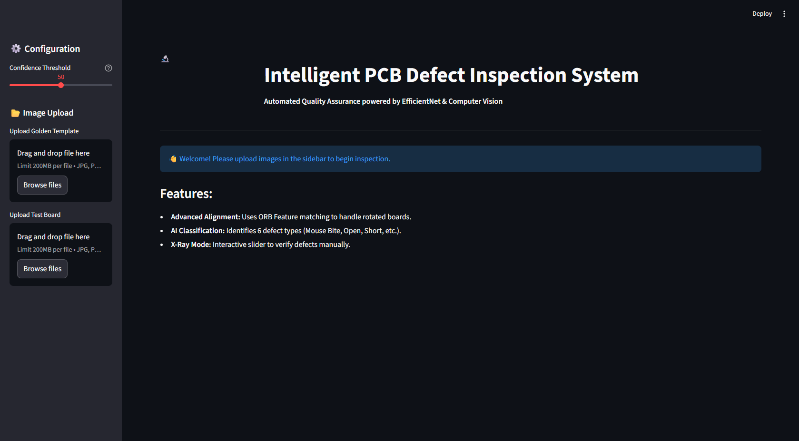
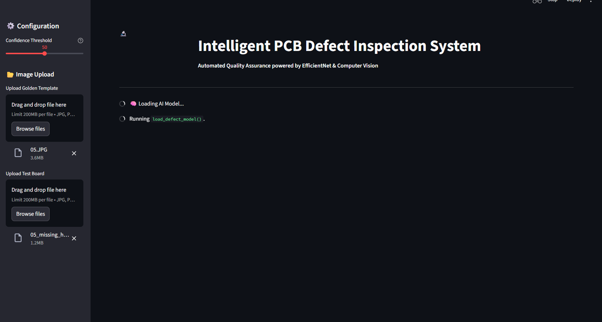
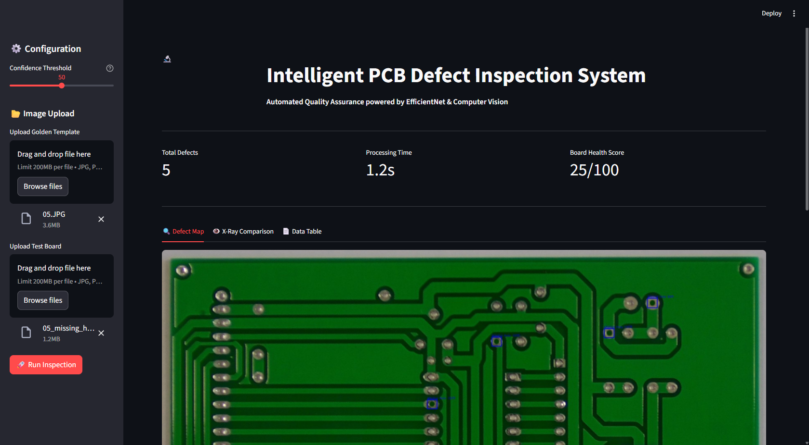
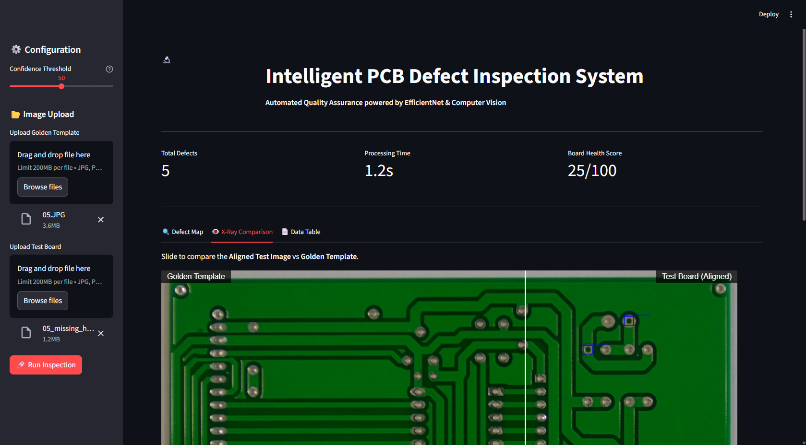
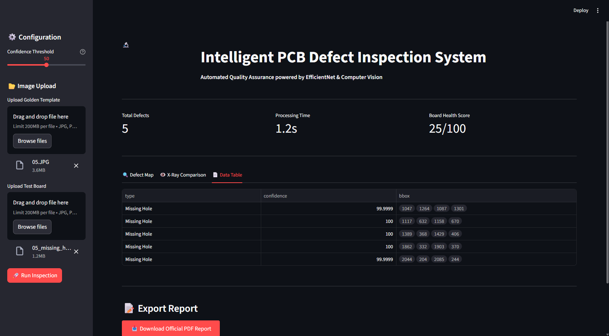

# 📘 Milestone 3: Frontend & Backend Integration

**Phase:** Milestone 3
**Focus:** Application Development & System Integration
**🎯 Objective:** Build a production-ready Web UI for real-time PCB defect inspection.
**🛠️ Tech Stack:** Streamlit, OpenCV, TensorFlow, FPDF

---

## 📖 Milestone Overview

This final milestone integrates the **Computer Vision Detection Pipeline (Milestone 1)** and the **Deep Learning Classifier (Milestone 2)** into a unified, user-friendly Web Application.

The system allows Quality Assurance (QA) engineers to upload PCB images, automatically detect and classify defects, and generate industry-standard inspection reports.

---

## 📂 Folder Structure

```text
Milestone 3/
│
├── app.py                    # 🖥️ Main Frontend Application (Streamlit)
│
├── src/                      # ⚙️ Backend Logic
│   ├── backend.py            # Image Alignment, Subtraction & Inference Pipeline
│   ├── config.py             # Global Configuration & Paths
│
├── models/                   # 🧠 Trained AI Models
│   └── pcb_defect_model_optimized.keras  # The 97.8% Accuracy Model
│
├── img/                      # 📸 Application Screenshots
│   ├── dashboard_before_uploads.png
│   ├── dashboard_after_uploads.png
│   ├── defect_map.png
│   ├── x-ray_comparison.png
│   └── data_table.png
│
├── requirements.txt          # Project Dependencies
└── README.md                 # Documentation

```

---

## 💻 Module 5: Web UI (Frontend)

We built a responsive dashboard using **Streamlit** that serves as the control center for the inspection process.

### ✨ Key Features

* **Interactive Sidebar:** Allows users to adjust the **Confidence Threshold** in real-time to filter weak predictions.
* **Dual-Image Upload:** Accepts both a "Golden Template" and a "Test Board" for comparative analysis.
* **"X-Ray" Vision Mode:** A custom component (`streamlit-image-comparison`) that allows users to slide between the reference and test images to manually verify defects.
* **Automated Reporting:** Generates and downloads a **PDF Inspection Certificate** containing visual proofs and defect logs.

---

## ⚙️ Module 6: Backend Pipeline

The backend (`src/backend.py`) orchestrates the complex logic required to go from raw pixels to a diagnosis.

### 🚀 The "Dual-Box" Inference Strategy

To resolve common misclassifications (e.g., *Short* vs. *Open Circuit*), we implemented a novel two-step processing strategy:

1. **Visualization Box (Tight Crop):**
* **Purpose:** User Interface.
* **Logic:** Tightly hugs the defect (padding +5px) to show the user exactly where the error is.
* **Result:** Clean, precise red bounding boxes on the screen.


2. **Context Box (Fixed Context):**
* **Purpose:** AI Prediction.
* **Logic:** Extracts a fixed 64x64 region (or larger) around the defect.
* **Result:** Provides the Neural Network with enough "surrounding visual context" to distinguish a broken track (*Open*) from a bridged track (*Short*).


---

## 🖼️ Application Showcase

### 1. The Dashboard (Initial State)

*A clean interface for uploading boards and configuring inspection parameters.*


### 2. Active Inspection

*Real-time feedback after uploading template and test images. The system calculates a Health Score instantly.*


### 3. Defect Detection Map

*Red bounding boxes automatically highlight all detected errors using the "Tight Crop" strategy.*


### 4. "X-Ray" Comparison Tool

*An interactive slider reveals the differences between the Reference and Test boards.*


### 5. Detailed Defect Log

*A structured data table listing all detected defects with confidence scores and coordinates.*


📥 **[Download Official PCB Inspection Report (PDF)](PCB_Inspection_Report.pdf)**

---

## 🚀 How to Run the App

### 1️⃣ Prerequisites

Ensure you have the trained model from Milestone 2 placed in the `models/` directory.

### 2️⃣ Install Dependencies

```bash
pip install -r requirements.txt

```

### 3️⃣ Launch the Application

```bash
streamlit run app.py

```

The application will open in your browser at `http://localhost:8501`.

---

## ✅ Final Project Status

| Milestone | Objective | Status | Result |
| --- | --- | --- | --- |
| **M1** | Defect Detection | ✅ Complete | **100% Recall** (0 Missed Defects) |
| **M2** | Defect Classification | ✅ Complete | **97.80% Accuracy** (EfficientNetB0) |
| **M3** | System Integration | ✅ Complete | **Fully Functional Web App** |

---
